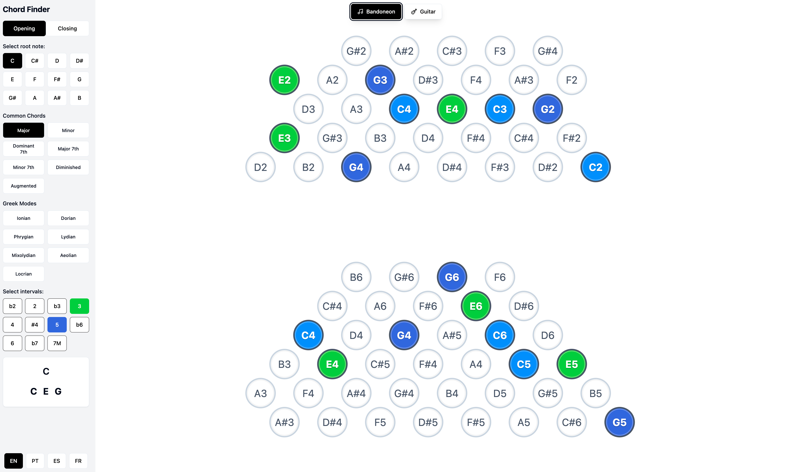
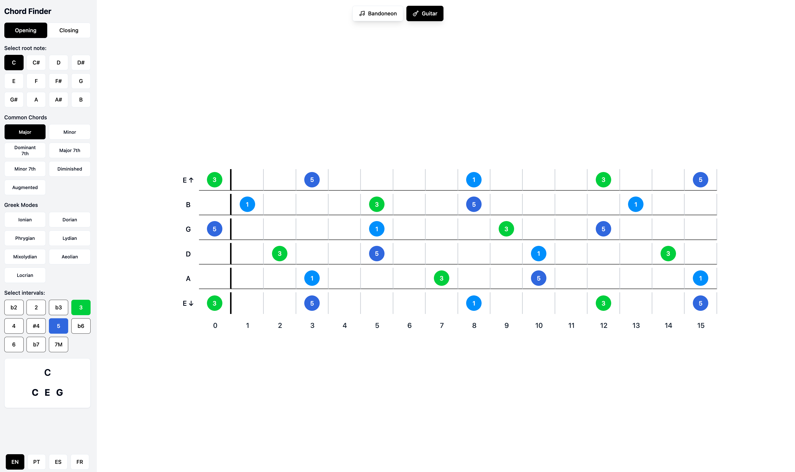

# 🎵 Harmonix - Interactive Music Theory Explorer

Harmonix is an elegant, interactive tool for exploring music theory concepts across different instruments. Currently supporting bandoneon and guitar, it provides a visual and intuitive way to understand chords, scales, and musical intervals.

🌐 **[Try it live!](https://joaocarabetta.github.io/harmonix)**

## 📸 Screenshots

<div align="center">
  
  <p><em>Bandoneon Mode - Visualize both hands with opening/closing positions</em></p>
  
  
  <p><em>Guitar Mode - Interactive fretboard with interval highlighting</em></p>
</div>

## ✨ Features

- **Multi-Instrument Support**
  - 🪗 Bandoneon visualization with opening/closing reed positions
  - 🎸 Interactive guitar fretboard display

- **Comprehensive Music Theory Tools**
  - 🎼 Visual chord construction and exploration
  - 🔄 Real-time interval visualization
  - 🎹 Common chord presets (Major, Minor, 7th, etc.)
  - 🎵 Greek mode exploration (Ionian, Dorian, etc.)

- **User-Friendly Interface**
  - 💫 Modern, minimalist design
  - 🎨 Color-coded intervals for easy recognition
  - 🔄 Seamless instrument switching
  - 🌈 Interactive chord display

- **Internationalization**
  - 🌍 Supports multiple languages:
    - English
    - Portuguese
    - Spanish
    - French

## 🚀 Getting Started

### Prerequisites

- Node.js (v14 or higher)
- npm or yarn

### Installation

1. Clone the repository:
```bash
git clone https://github.com/yourusername/harmonix.git
cd harmonix
```

2. Install dependencies:
```bash
npm install
# or
yarn install
```

3. Start the development server:
```bash
npm run dev
# or
yarn dev
```

4. Open your browser and navigate to `http://localhost:3000`

## 🛠️ Built With

- [React](https://reactjs.org/) - Frontend framework
- [TypeScript](https://www.typescriptlang.org/) - Type safety
- [Tailwind CSS](https://tailwindcss.com/) - Styling
- [i18next](https://www.i18next.com/) - Internationalization

## 🤝 Contributing

Contributions are welcome! Feel free to:

1. Fork the repository
2. Create a feature branch (`git checkout -b feature/AmazingFeature`)
3. Commit your changes (`git commit -m 'Add some AmazingFeature'`)
4. Push to the branch (`git push origin feature/AmazingFeature`)
5. Open a Pull Request

## 📝 License

This project is licensed under the MIT License - see the [LICENSE](LICENSE) file for details.

## 🙏 Acknowledgments

- Inspired by the rich musical heritage of the bandoneon and its role in tango music
- Special thanks to the music theory community for their invaluable resources

---

Made with ♥ by [Your Name]

*"Music is the universal language of mankind" - Henry Wadsworth Longfellow*
